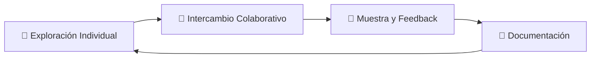

<div align="center">

# 🚀 Laboratorio de Programación Creativa

### *Donde el código se convierte en herramienta para imaginar, experimentar y construir*


---

</div>

## 📜 Manifiesto

> **Creemos en el poder del código como lenguaje de creación, expresión y transformación.**
>
> La programación no es solo una habilidad técnica: es una forma de pensar, de construir mundos posibles.
>
> **Defendemos una visión amplia de la creatividad:** desde algoritmos poéticos hasta robots, desde visuales generativos hasta tiendas online.
>
> **Fomentamos el aprendizaje horizontal y colaborativo.** Cada participante trae sus intereses, y juntos creamos un espacio donde las ideas se cruzan y se expanden.
>
> **Celebramos el error, la prueba, el prototipo.** Cada línea de código puede ser una pregunta abierta.
>
> **Construimos comunidad.** El laboratorio es una red viva de personas que comparten conocimientos y cocrean con impacto técnico, artístico y social.

---

## 🎯 Objetivos

<table>
<tr>
<td width="50%">

### 🔍 **Exploración**
Fomentar la exploración creativa y técnica a través de la programación

### 🤝 **Colaboración**
Impulsar la colaboración entre personas con intereses comunes

</td>
<td width="50%">

### 📈 **Acompañamiento**
Acompañar los proyectos personales de cada participante

### 📚 **Documentación**
Documentar los procesos en plataformas abiertas

</td>
</tr>
</table>

---

## 🛠️ Stack Tecnológico

### 🔧 **Hardware & Sistemas**
```
🟢 Arduino          - Prototipado electrónico
🟢 Raspberry Pi     - Computación embebida
🟢 Linux            - Sistema operativo libre
```

### 🌐 **Desarrollo Web**
```
🟡 HTML/CSS         - Estructura y diseño
🟡 JavaScript       - Interactividad
🟡 Node.js          - Backend
🟡 Frameworks       - Vue, React, etc.
```

### 🐍 **Programación General**
```
🔵 Python           - Versátil y poderoso
🔵 Processing       - Arte visual
🔵 p5.js            - Creatividad web
```

---

## 💡 Portfolio de Proyectos

<div align="center">

### 🌟 **¿Qué puedes crear?**

</div>

<table>
<tr>
<td width="50%">

### 🌐 **Proyectos Web**
- ✨ Sitios web personales
- 🛒 Tiendas online
- 🎮 Aplicaciones interactivas
- 📝 Blogs y contenido

### 🎨 **Arte & Visualización**
- 🎭 Arte generativo
- 📊 Visualización de datos
- 🖼️ Instalaciones interactivas
- 🎬 Animaciones procedurales

</td>
<td width="50%">

### 📚 **Herramientas Educativas**
- 👨‍🏫 Apps de enseñanza
- 🎲 Juegos educativos
- 🔬 Simuladores
- 📱 Herramientas de aprendizaje

### 🔧 **Utilidades & Automatización**
- 🤖 Scripts de automatización
- ⚡ Apps de productividad
- 🔌 Proyectos IoT
- 📈 Herramientas de análisis

</td>
</tr>
</table>

---

## 🧩 Metodología del Laboratorio

### 🔄 **Flujo de Trabajo**



<table>
<tr>
<td width="33%">

### 🎯 **Exploración Individual**
- Trabajo personal en tu proyecto
- Orientación técnica personalizada
- Experimentación libre

</td>
<td width="33%">

### 🤝 **Intercambio Colaborativo**
- Diálogo libre de ideas
- Resolución colectiva de problemas
- Conexiones entre proyectos

</td>
<td width="33%">

### 📢 **Muestra y Feedback**
- Presentaciones informales
- Retroalimentación constructiva
- Planificación conjunta

</td>
</tr>
</table>

---

## 📅 Información Práctica

<div align="center">

### 🗓️ **Horarios & Modalidad**

| **Aspecto** | **Detalle** |
|-------------|-------------|
| 🚀 **Inicio** | Sábado 9 de agosto |
| ⏰ **Horario** | Sábados 11:00 - 13:00 |
| 🕐 **Duración** | 2 horas semanales |
| 🔄 **Modalidad** | Talleres técnicos + Sesiones libres + Presentaciones |
| 📝 **Documentación** | Repositorios abiertos en GitHub |

</div>

---

## 📍 Ubicación

<div align="center">

### 🏢 **Taller Mo**
*Escuela de Artes Combinadas e Inclusivas*

📍 **Tte. Gral Juan Domingo Perón 1299**
🌆 **Microcentro, Buenos Aires (1038)**

[](https://maps.app.goo.gl/KaN1YyPsimvKxeFg9)
[](https://www.instagram.com/taller.mo/)

</div>

> **Taller Mo** es una escuela de artes combinadas e inclusivas que comparte nuestra visión de la creatividad como forma de expresión y transformación. Su espacio en el Microcentro ofrece el ambiente perfecto para el intercambio de ideas y la experimentación colaborativa.

---

## 👨‍🏫 Facilitador

<div align="center">

### **Juan Manuel Daza**
*Desarrollador Full Stack | Tecnología + Creatividad + Cultura*

[](https://linkedin.com/in/juanmanueldaza)
[](https://github.com/juanmanueldaza)
[](https://daza.ar)

</div>

**🎯 Perfil Profesional:**
- 🚀 **5+ años** de experiencia en desarrollo Full Stack
- 💻 **Especialista en:** JavaScript, PHP, Node.js, Python, Vue, React
- 🏢 **Analista Senior** en Accenture Argentina
- 🎵 **Colaborador** con INAMU (Instituto Nacional de la Música)

**🎨 Enfoque Multidisciplinario:**
- 📚 Formación en literatura y periodismo musical
- 🎭 Gestión cultural y proyectos artísticos
- 🔬 Metodología centrada en el usuario
- 🌟 Fusión de tecnología con disciplinas creativas

> *"La programación no es solo una habilidad técnica, sino una forma de pensar y construir mundos posibles"*

---

## 👥 ¿Quién Puede Participar?

<table>
<tr>
<td width="50%">

### 🛍️ **Emprendedores**
Quieren crear soluciones digitales, tiendas o sitios web para sus negocios.

### 🎨 **Artistas**
Buscan nuevas formas de expresión con visuales o sonido. Quieren portfolios digitales.

### 📚 **Educadores**
Quieren enseñar programación desde lo creativo y exploratorio. Necesitan plataformas educativas.

</td>
<td width="50%">

### ⚙️ **Hackers Caseros**
Gente curiosa que quiere experimentar con hardware y código.

### 🧠 **Creativos Híbridos**
Mezclan tecnología, arte, pedagogía o activismo en sus proyectos.

### 🔰 **Principiantes Motivados**
Sin experiencia previa pero con ganas de aprender y crear.

</td>
</tr>
</table>

---

<div align="center">

## 🚀 ¿Listo para Crear?

### *El futuro se construye línea por línea*

[](mailto:contacto@daza.ar)

**¿Tienes preguntas? ¿Quieres más información?**
📧 [contacto@daza.ar](mailto:contacto@daza.ar)

---

*Laboratorio de Programación Creativa - Donde el código cobra vida*

</div>
